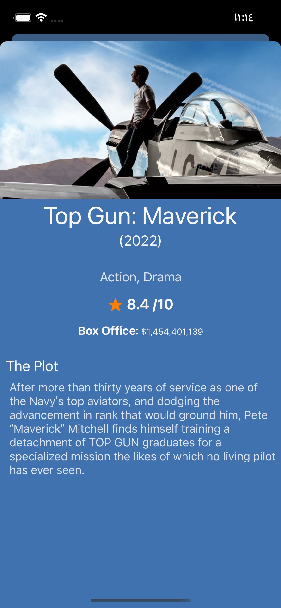

# MoviesApp
An IOS application that displays the list of trending movies, when we select one movie it shows more details about it.

 

# Displaying Movies

Home screen displayed the trending movies.
 
 

# Movie Details
Screen to display any movie more details (year of release, rating, plot ,...)
 
 

# Technical details
**Architecture:** MVP
 
 
**UI:** UIKit
 
 
**Language:** Swift
 
 
**iOS Support:** iOS 15.0 or later
